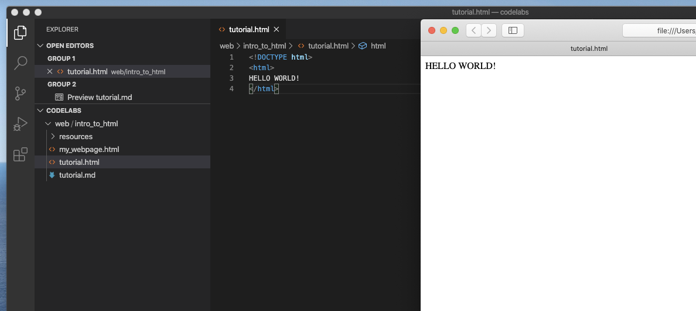

# Project Margaret Hamilton
## Introduction to HTML

Welcome to this introduction to HTML. Web pages have evolved a lot over the years and will often now be made up of lots of different kinds of components including HTML (HyperText Markup Language), JavaScript (JS), Cascading Style Sheets (CSS) and so on. In this tutorial, we'll make a basic web page with some HTML elements, apply some styling to them (with CSS) and then add a little script (in JS) to add a bit of interactivity to the page. But before we dig into this, let's have a quick look at how a webpage typically gets displayed on our screens.

1. A user enters the URL of the site they want to visit into the web browser.
2. The browser makes a request to the Domain Name Server to convert the URL into a physical Internet Protocol (IP) address.
3. With the IP address of the website host machine, or server, the browser can make a connection to the host and request the page. If the URL that the user enters includes a slug (a specific path made with forward slashes after the domain) then the host will return that specific page, otherwise, it will return whatever page is configured to be shown. For example, if a user were to enter bbc.co.uk/news then the server would know to return the news page instead of the main BBC home page.
4. As the file is received, the browser begins to render the contents. In modern pages, there will very often be lots of links to other files that the browser must also get while loading the page. For example, there will be images and maybe other media content that needs to be loaded. There will also be script files that will execute logic as part of the page load and in response to user interaction. There will also be files that contain data for the page to show (perhaps a user name if registered with the site) and so on.
5. Eventually, when all of the individual compoinents are loaded, all scripts executed, external data pulled in and there is nothing else left to do, the page is displayed and the user will begin to browse and interact with that page.

But let's not worry too much about all of those steps just yet!! In their least complicated form, websites are just files. In fact, you can load an html file from your local computer in your web browser. In this folder there should be a file called `tutorial.html`. Double click on that and it should open with your web browser. It's not much of a webpage just yet, in fact, all it does is ay "Hello World" but we have to start somewhere, so why not here? Let's go!


### Preparation and set up

While it is possible to write a perfectly functional website with something like notepad, it's not going to be easy, so we recommend installing an Integrated Development Editor (IDE) to make things easier for ourselves. (Some people say programmers are lazy and that we spend our time making things easy for ourselves. I'd disagree with them, but I can't be bothered...) Anyway, back to the setup. If you've already installed Visual Studio (VS) Code from a previous tutorial, then you can skip this (yay!) but if not, then head over to the [Visual Studio Code Download Page](https://code.visualstudio.com/Download) and then click on the download link for the operating system you're working on.

When that's downloaded, open the installer and follow the instructions to install the editor. By default, VS Code is all ready for wiritng HTML with some nice auto complete features to help with the names of tags and their associated attributes. (We'll explain what tags and attributes are later.)


### Making out web page

Let's begin by opening up VS Code and then from the File menu, select the option `Add Folder to Workspace...` browse to the folder `codelabs` and select to `Add` it. You should now see the contents of this folder listed in the project explorer. If the project explorer isn't open, the shortcut is `Cmd + Shift + E` on macOS or `Ctrl + Shift + E` on Windows. 

From the explorer, click on `tutorial.html` so that we can becgin to edit our webpage. In addition to opening the page in our editor, so that we can see our changes, we should also open in in a browser too. To do this, right click on the file's tab in VS Code and press on the option to `Copy Path`. Next, press ```Ctrl + ` ```to open the integrated terminal/command prompt. In there, enter the command `open ` and then paste the path to the web page. For example:

```
open /Users/admin/dev/codelabs/web/intro_to_html/tutorial.html
```

Now you should be able to see the webpage in raw HTML format in VS Code as well as its rendered state in the browser:



